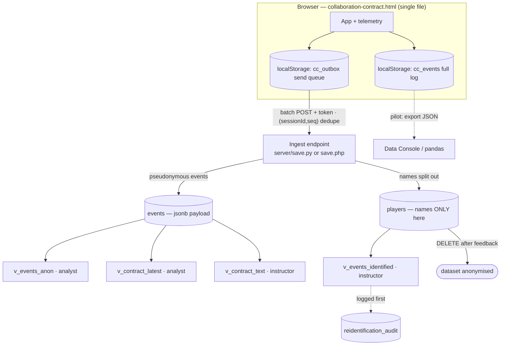

# Collaboration Contract — Technical Documentation

Storage and data architecture for the Collaboration Contract app (IT:U). This
document is the technical companion to `README.md` and the design/research plan
(`Collaboration_Contract_Plan.docx`). It describes how data is captured,
transmitted, stored, protected, and analysed.

The architecture is adapted from the **PBL Board Game** telemetry layer by
**@rijdho (Ricardo)** — the same identity-separation, pseudonymous event stream,
`(sessionId, seq)` dedupe, EU storage routes, and access-by-design under GDPR
Art. 25. Section 12 lists what is contract-specific.

---

## 1. System overview



Three tiers:

- **Client** — one static HTML file. Runs offline; embeddable via iframe
  (Confluence / Canvas). Buffers all telemetry locally and, in production, also
  queues it for delivery.
- **Ingest endpoint** — a tiny stateless service that validates a token, splits
  member names out of the stream, and inserts events with dedupe.
- **Database** — PostgreSQL (production) or SQLite (local/testing), holding the
  identity table, the event stream, an audit log, and read views.

---

## 2. Data model

Three tables (`server/schema.sql`).

| Table | Holds | Access |
|---|---|---|
| `players` | `player_id` (uuid), `session_id`, `name`, `created_at`. **The only place names live.** | Instructor role only |
| `events` | `session_id`, `seq`, `event`, `ts`, `group_name`, `cohort`, `course`, `player_id`, `payload` (jsonb). Pseudonymous. | Via views |
| `reidentification_audit` | `accessed_by`, `accessed_at`, `reason`, `session_id`. Every identified read. | Instructor writes |

Key constraint: `events` has `UNIQUE (session_id, seq)`. `seq` is a
monotonic counter per session on the client, so re-sent events (retries,
`sendBeacon` duplicates) are **idempotent** — the endpoint inserts with
`ON CONFLICT DO NOTHING`.

Deleting `players` at the end of the feedback period is the anonymisation event:
the event stream keeps only pseudonyms and can no longer be linked to people.

---

## 3. Event catalog

Every event shares a common envelope; event-specific fields follow. The unit of
analysis is the **group session**.

**Envelope:** `event`, `sessionId`, `seq`, `ts` (ISO 8601), `schemaVersion`,
`appVersion`, `deckVersion`, `cohort`, `course`, `groupName`.

| Event | When | Key payload |
|---|---|---|
| `consent_ack` | A member ticks their consent box | `playerId` (pseudonym), `consentVersion`. One per member. |
| `session_start` | Group starts the contract | `players: [{playerId, name}]` — **names stripped by the endpoint** into `players`; `playerCount`. |
| `section_saved` | A section is saved (Save & continue) | `section` (`q1`…`q5`), `sectionName`, `dwellMs` (time on the section), `wordCount`, `values` (count, on q4). |
| `contract_complete` | Group finishes | `sectionsCompleted`, `totalDwellMs`, `values` (array), `valuesCount`, `commitment` (`{playerId: 1–5}`), `text` (all free-text answers — see §5). |
| `contract_export` | Group downloads the contract JSON | — |
| `badge_download` | Group downloads the badge PNG | `members` (count). |
| `save_exit` | Page hidden mid-contract | `step`. Session-persistence signal. |

Payloads are stored verbatim as `jsonb`, so adding fields never breaks old rows.

---

## 4. Client telemetry & transport

Two localStorage keys:

- `cc_events` — the **full local log**. Never pruned by the app; it is what the
  “Download research data (JSON)” button exports and what the pilot Data Console
  reads. Contains no auth token.
- `cc_outbox` — the **send queue** for production. Drained by `flush()`.

`flush()` (in `collaboration-contract.html`):

```js
// POST the whole outbox as one batch; attach the token only at send time.
// On 2xx, remove the events we just sent (anything queued during the await stays).
// On non-2xx (e.g. 403 bad token) or network error, keep the queue and retry.
const res = await fetch(CONFIG.endpoint, { method:'POST', keepalive:true,
  headers:{'Content-Type':'application/json'},
  body: JSON.stringify(out.map(e => ({ ...e, token: CONFIG.token }))) });
if (res.ok) { /* drop the sent seqs from cc_outbox */ }
```

Delivery triggers: on every `emit()` (if an endpoint is configured), on the
`online` event, on page load (drains anything left from an offline session), and
on `pagehide` via `navigator.sendBeacon` as a last chance. Because the server
dedupes on `(sessionId, seq)`, none of these can double-count.

**Route 0 (pilot).** Leave `CONFIG.endpoint` empty. `flush()` is a no-op; data
lives only in `cc_events` and is exported manually. Pilot data is test data.

**Production.** Set `CONFIG` at the top of the `<script>`:

```js
const CONFIG = { endpoint:'https://your-host/ingest', token:'<shared token>',
                 appVersion:'2.1.0', schemaVersion:2, deckVersion:'1.0' };
```

---

## 5. Contract content model (how the five questions are captured)

The contract *content* is the research object, and much of it is free text, which
is more sensitive than the PBL game's card telemetry. The client therefore splits
what it sends on `contract_complete`:

- **Structured, non-identifying** → stays in the anonymised view:
  - `values` — the categorical values the group chose (RQ4).
  - `commitment` — each member's 1–5 time/energy rating, keyed by **pseudonym** (RQ3).
  - `valuesCount`, `totalDwellMs`, and per-section `dwellMs`/`wordCount` from `section_saved`.
- **Free text** → `text` object (roles, motivations, strengths, weaknesses,
  shared goal, value examples, communication/decision/conflict/needs norms).
  Keyed by pseudonym; **excluded from the analyst view** and exposed only through
  the restricted `v_contract_text` view for qualitative coding.

This means quantitative analysis (RQ3, RQ4, engagement, timing) never needs to
read personal text, and the free text is access-controlled and reviewable before
any external sharing.

---

## 6. Ingest endpoint

Two equivalent implementations ship in `server/` (same wire contract):

- `save.py` — Python stdlib, **SQLite**. Zero dependencies; good for local
  testing and small single-host deployments.
- `save.php` — PDO, **PostgreSQL or SQLite**. For PHP hosting / production.

**Request.** `POST` a JSON event or an array of events. Each event must carry the
shared `token` and at least `event`, `sessionId`, `seq`, `ts`.

**Processing.**

1. Reject bodies larger than `CC_MAX_BYTES` (default 2 MB) with `413`.
2. For each event: drop it unless `token` matches; drop it unless the four
   required envelope keys are present.
3. On `session_start`, insert each `{playerId, name}` into `players` and rewrite
   the event's `players` to `[{playerId}]` — **names never reach `events`**.
4. Strip `token`, insert into `events` with `ON CONFLICT (session_id, seq) DO NOTHING`.

**Response.** `200 {ok, accepted, stored}` normally; **`403`** when a non-empty
batch had **zero** accepted events (usually a token mismatch) — this is important:
a `200` there would make the client drop a queue that was never stored. `400` on
invalid JSON, `413` on oversized bodies.

**Config (env):** `CC_TOKEN`, `CC_ORIGIN` (CORS — lock to the Pages origin in
production), `CC_PORT`, `CC_DB` (Python/SQLite) or `CC_DSN` / `CC_DB_USER` /
`CC_DB_PASS` (PHP/Postgres), `CC_MAX_BYTES`.

> Verified end-to-end against `save.py`: batch stored, duplicate `seq` deduped
> (stored 0), bad token → 403, names split into `players` and stripped from the
> event payload, structured content preserved.

---

## 7. Storage routes

Routes A and B run the **same schema and the same ingest code**; the choice is
administrative, not technical.

| | Route 0 — Pilot | Route A — University cloud | Route B — Open Telekom Cloud |
|---|---|---|---|
| Data home | Device `localStorage` + exported files | PostgreSQL on IT:U infra | Managed PostgreSQL (T-Systems), EU |
| Backend | None (static host) | Ingest endpoint + DB | Ingest endpoint + managed DB |
| GDPR posture | Test data only | Controller hosts its own data; no Art. 28 processor | T-Systems as processor: sign DPA/AVV; EU-only |
| When it wins | Now, while A/B is set up | University offers managed Postgres | No university offering / prefer managed ops |

Migration is `pg_dump`/`pg_restore`; the client is untouched (only `CONFIG`
changes). Pilot JSONs can be replayed into production against the same endpoint.

---

## 8. GDPR & access-by-design

- **Identity separation** — names live only in `players`; the stream is
  pseudonymous (`playerId` UUIDs; analysis uses per-session codes P1, P2…).
- **Views (least privilege):**
  - `v_events_anon` — analyst; per-session codes; `payload - 'text'` (free text removed).
  - `v_contract_latest` — analyst; one structured row per finished contract (values, commitment).
  - `v_contract_text` — instructor/teaching team; the free-text answers, for qualitative coding.
  - `v_events_identified` — instructor; joins `players` for feedback. **Log to
    `reidentification_audit` first.**
- **Roles:** `cc_ingest` (INSERT only), `cc_analyst` (anon + structured views),
  `cc_instructor` (identified + text + audit).
- **Consent** — each member consents individually; recorded as `consent_ack` with
  a `consentVersion`. The consent notice names the contact for withdrawal.
- **Withdrawal / erasure** — because names live only in `players`, honouring a
  request is `DELETE FROM players WHERE player_id = '<uuid>'` (breaks the name
  link); optionally also delete that member's contributions if asked.
- **Retention** — `DELETE FROM players;` at the end of the feedback period
  irreversibly anonymises the dataset. Set and calendar a fixed retention window.
- **Free-text caution** — `text` fields may name teammates; excluded from the
  analyst view and reviewed before any external sharing.

---

## 9. Security

- The client **token is not a secret** — it is visible on any static host by
  design. Security lives server-side: CORS locked to the Pages origin
  (`CC_ORIGIN`), HTTPS only, and the DB credentials used by the endpoint are the
  **ingest role only** (INSERT, nothing else).
- Request bodies are size-capped (`CC_MAX_BYTES`) to avoid unbounded reads.
- Dedupe (`UNIQUE (session_id, seq)`) makes retries and duplicate beacons safe.
- `save.py` uses SQLite and is for testing / small deployments; for production
  Postgres use `save.php` or port `save.py` to psycopg before relying on it.

---

## 10. Deployment (summary)

1. **Pilot (Route 0):** publish the HTML on any static host (e.g. GitHub Pages);
   `CONFIG.endpoint` empty. Collect exported JSONs.
2. **Production DB:** pick Route A or B; run `psql -f server/schema.sql`; create
   the three roles (least privilege).
3. **Endpoint:** deploy `save.php` (or `save.py`) on a host that reaches the DB;
   set `CC_TOKEN`, `CC_ORIGIN`, DB creds; HTTPS.
4. **Point the client:** set `CONFIG.endpoint` + `token`; redeploy. Buffered
   offline events flush automatically.
5. **Optional:** replay pilot JSONs into production (same contract; dedupe makes
   it safe).

Pre-launch checklist: DB home chosen + DPO informed · `schema.sql` applied + roles
created · endpoint on HTTPS with `CC_ORIGIN` locked + fresh `CC_TOKEN` ·
`CONFIG` set + redeployed · test session shows a row in `events` and the name only
in `players` · retention date calendared.

---

## 11. Analysis (research questions → data)

**Pilot analysis — the Data Console (`analysis.html`).** Before the production DB
exists, analysis runs entirely in the browser. `analysis.html` loads this
device's `cc_events` buffer and/or JSON files imported from other devices into an
in-memory SQLite (sql.js/WASM, self-hosted in `vendor/sqljs/` — no external
requests), applying the **same ingest contract** as the server (name-splitting,
`(sessionId, seq)` dedupe). It ships preset queries for each RQ below and exports
results to CSV, the whole DB to `.sqlite` (opens in pandas), and raw events to
JSON. This mirrors the PBL Board Game's Data Console by @rijdho. Because the
contract app never puts names in telemetry, the `players` table stays empty and
analysis is pseudonymous from the first row; the `anon` preset also strips the
free-text `text` field via `json_remove`.

| RQ (Holgaard 2021) | Signal | Source |
|---|---|---|
| Q1 Who are we | reflection depth, completion | `section_saved` (q1) word counts; `v_contract_text` |
| Q2 What can we do | strengths/weaknesses/development balance | `v_contract_text` (q2) |
| Q3 How far willing to go | commitment 1–5 per member (mean & spread); time spent | `v_contract_latest.commitment_by_code`; `section_saved.dwellMs` |
| Q4 Good project group | value frequency; has-example rate | `v_contract_latest.values_chosen`; `v_contract_text` |
| Q5 Good group work | specificity of norms | `v_contract_text` (q5) |

Observations are nested (members within groups, groups within cohorts): use the
group as the unit, or a mixed model with a group random effect. Example:

```sql
-- Value frequency across a cohort
SELECT v AS value, count(*) AS groups
FROM v_contract_latest, jsonb_array_elements_text(values_chosen) AS v
WHERE cohort = 'WS2026'
GROUP BY v ORDER BY groups DESC;

-- Commitment spread per group (mismatch is a risk signal)
SELECT session_id, group_name,
       min(c::int) AS min_commit, max(c::int) AS max_commit,
       round(avg(c::int),2) AS avg_commit
FROM v_contract_latest, jsonb_each_text(commitment_by_code) AS kv(pcode, c)
GROUP BY session_id, group_name;
```

---

## 12. What is improved vs the PBL baseline

Credit: the identity split, pseudonymous stream, `(sessionId, seq)` dedupe,
three EU routes, anon/identified views, audit log and retention-by-deletion are
all from **@rijdho's** PBL Board Game architecture. Contract-specific changes:

1. **Content is transmitted, not just telemetry.** The contract's answers are the
   research object, so `contract_complete` carries a structured/free-text split
   (§5) instead of only timings. `v_contract_latest` and `v_contract_text` are
   new views built for that.
2. **Real client transport implemented.** The app now has an outbox, batch
   `flush()`, token attachment at send time, `online`/load/`pagehide` triggers and
   `sendBeacon` — previously only a local buffer with a stub.
3. **Free-text stays out of the analyst view by default** (`payload - 'text'`),
   with a separate restricted view — tighter than stripping only note fields.
4. **Withdrawal path documented** at the individual level (delete one `players`
   row), matching the app's individual (not group) consent model.
5. **Endpoint hardening:** explicit request-body size cap (`CC_MAX_BYTES` → 413).

---

## 13. Credits

Architecture adapted from the **PBL Board Game “The Dachstein Ascent”** data layer
by **@rijdho (Ricardo)**, IT:U. Instrument: **Team Canvas** (Ivanov &
Voloshchuk, CC BY-SA 4.0). Questions: **Holgaard et al. (2021)**. Interface
design: **Guess the Replication** (Röseler & Röseler, CC BY 4.0). Built with
**Claude** (Anthropic). Licensed **CC BY-SA 4.0** (see `LICENSE`). Contact:
**Marjorie Cristina Da Cruz** · marjorie.da-cruz@it-u.at
